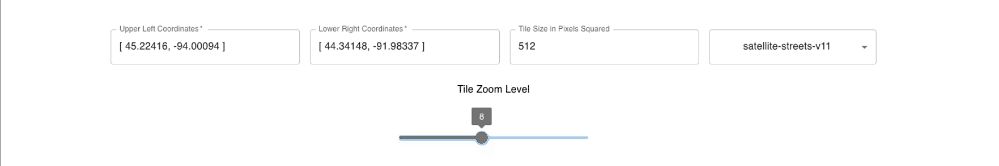

# Static MapTile Downloader

https://nicklpeterson.github.io/mapbox-tiles/

A simple web app made for The Center for Global Environmental Education at Hamline University.

### How to Use

#### Select an area of map tiles

- The app will include all tiles that your selected area is touching. So the number of downloaded tiles can seem large. 
- For more precision, enter the upper left and lower right coordinates of the bounding box manually.
- Note that the map tiles files you download are higher quality than the map you see in the browser.


#### Select features

- Coordinates: These define the bounding box of tiles you will download.
- Tile Size: The tiles can be 256, 512, or 1024 pixels
- Style: These are the map styles provided by mapbox.



#### Download Tiles

- Use caution - confirm you are downloading the correct number of files.


### API Documentation

This app uses the mapbox static tiles api - https://docs.mapbox.com/api/maps/static-tiles/ 


### Local Development

- Install Dependencies:
```
yarn
```

- Run locally on port 3000:
```
yarn start
```

### Contribution

Found a bug or want more features? Create an issue or make a PR.

